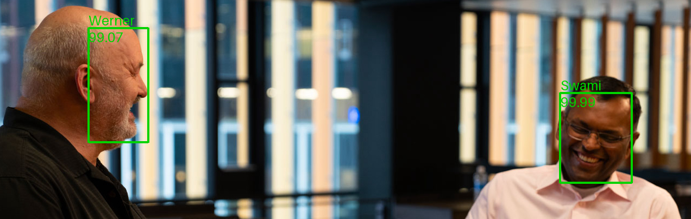

## Improving Accuracy of Rekognition Face Search with User Vectors
### Face matching of images against a private collection of users faces

---
This repository contains an end to end example (implemented in a Jupyter notebook) how to build a face search system using [Amazon Rekognition](https://aws.amazon.com/rekognition/). 
Amazon Rekognition enables you to achieve very high face search accuracy with a single face image. In some cases, you can use multiple images of the same person's face to create user vectors and improve accuracy even further. This is especially helpful when images have variations in lighting, poses, and appearances. 

This will guide you through creating a collection, storing face vectors in that collection, aggregating those face vectors into user vectors, and then comparing the results of searching against those individual face vectors and user vectors.

In June 2023, [AWS launched user vectors, a new capability that significantly improves face search accuracy](https://aws.amazon.com/about-aws/whats-new/2023/06/amazon-rekognition-face-search-accuracy-user-vectors/) by leveraging multiple face images of a user. Now, customers can create user vectors, which aggregate multiple face vectors of the same user. User vectors offer higher face search accuracy with more robust depictions, as they contain varying degrees of lighting, sharpness, pose, appearance, etc. This improves the accuracy compared to searching aginst individual face vectors.

**NOTE: You can run the notebook in SageMaker Studio, JupyterLab, or on your local machine**

---

## Security

See [CONTRIBUTING](CONTRIBUTING.md#security-issue-notifications) for more information.

## License

This library is licensed under the MIT-0 License. See the LICENSE file.

